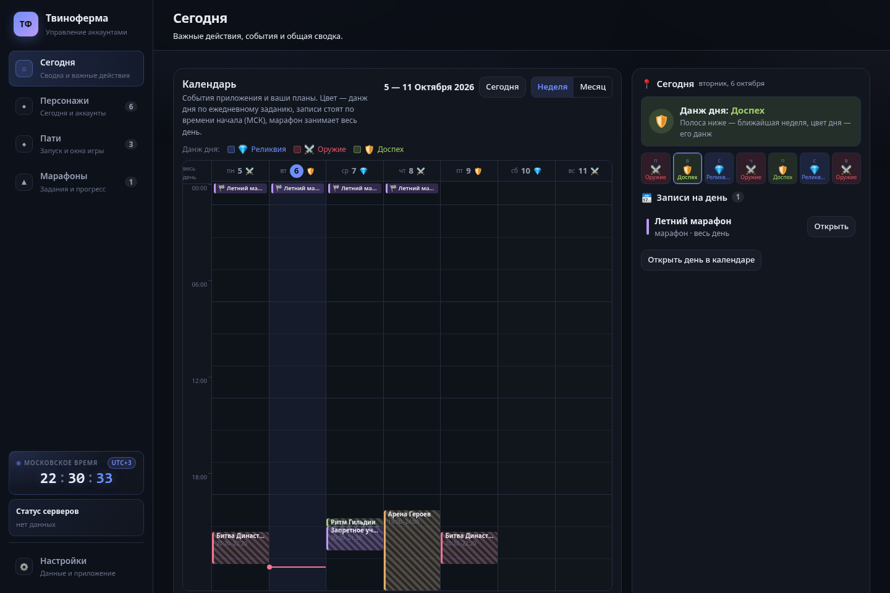
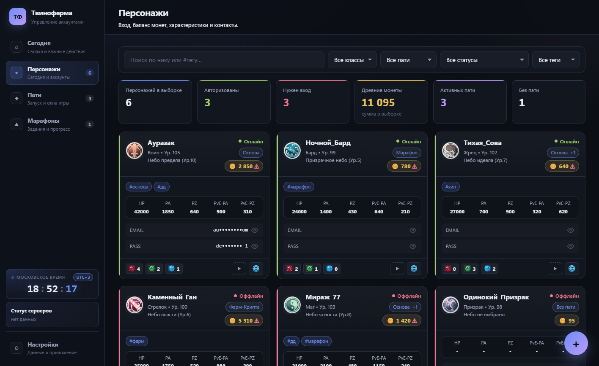
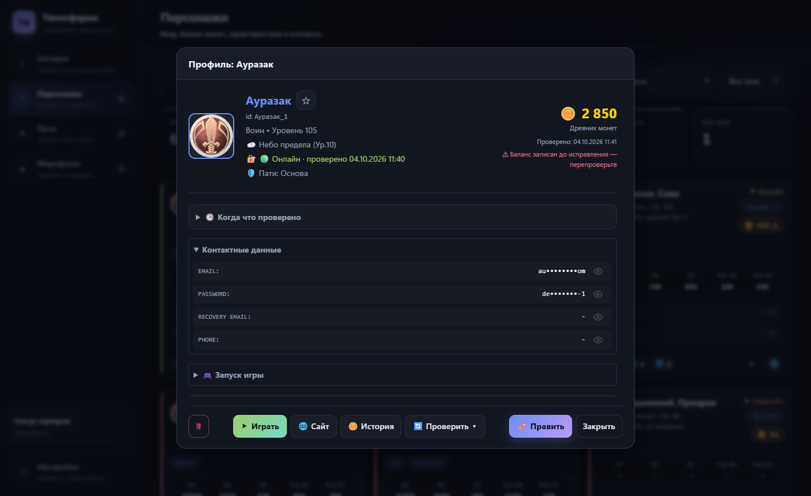
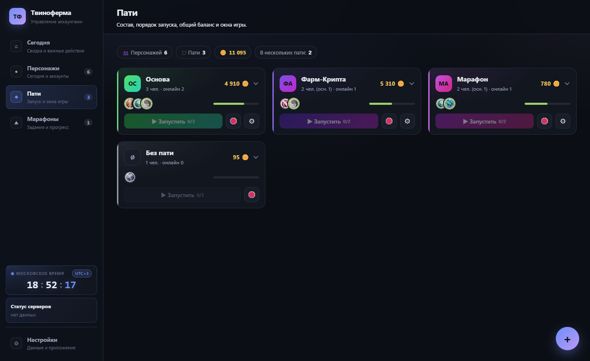
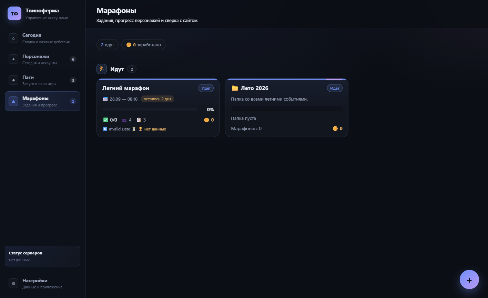
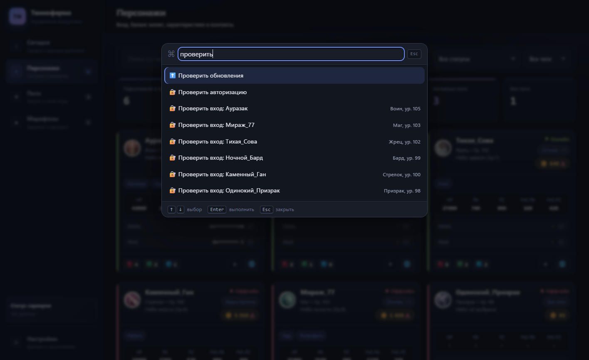

# 🛠️ Твиноферма (Tvinoferma)

**Твиноферма** — десктопный кабинет для игроков в *Perfect World*: управление несколькими
аккаунтами, авторизация на сайте игры, баланс древних монет, марафоны, календарь событий,
запуск окон игры и автоматизация рутины.

> ⚠️ **Важно:** это только **локальный менеджер**. Программа **не взаимодействует
> с игровым сервером**, не играет за вас и не является читом. Всё, что она делает на сайте, —
> открывает официальные страницы в своём браузере и **читает** их.

<p align="center">
  
</p>

---

## 📖 Содержание

- [Что умеет](#-что-умеет)
  - [Экран «Сегодня»](#-экран-сегодня)
  - [Персонажи](#-персонажи)
  - [Пати](#-пати-группы-аккаунтов)
  - [Марафоны](#-марафоны)
  - [Календарь и постоянные ивенты](#-календарь-и-постоянные-ивенты)
  - [Запуск игры](#-запуск-игры)
  - [Автоматизация: промокоды и передача предметов](#-автоматизация-промокоды-и-передача-предметов)
  - [Надёжность данных](#-надёжность-данных)
  - [Командная палитра](#-командная-палитра)
- [Установка](#-установка)
- [Как начать работу](#-как-начать-работу)
- [Горячие клавиши](#-горячие-клавиши)
- [Частые вопросы](#-частые-вопросы)
- [Безопасность и приватность](#-безопасность-и-приватность)
- [Что нового](#-что-нового)
- [Для разработчиков](#-для-разработчиков)
- [Поддержка](#-поддержка)
- [Лицензия](#-лицензия)

---

## ✨ Что умеет

### 📍 Экран «Сегодня»

Главная страница отвечает на вопрос «что делать сейчас?», а не показывает список карточек.

<p align="center">
  
</p>

- **Требуют внимания** — истёкшие сессии, отставания в марафонах, давно не проверенный баланс.
  В каждой строке кнопка действия: «Проверить вход», «Обновить баланс», «Открыть». Блок занимает
  ровно 5 строк и прокручивается, поэтому не растягивает страницу.
- **Сводка** — древние монеты, число персонажей и сколько из них авторизовано, что скоро
  заканчивается, пати с онлайн-составом.
- **Календарь и панель дня** — рядом с сеткой видно данж дня и записи на сегодня.

### 👤 Персонажи

<p align="center">
  
</p>

- **Карточки** с ником, классом, уровнем, небом, тегами, заметками и балансом монет.
- **Профиль персонажа** — контакты, характеристики, история монет, запуск игры, пати.
  Кнопка «📷 Заполнить со скриншота» распознаёт характеристики снимком окна статов.
- **Фильтры** по классу, пати и тегу, поиск по нику. Сортировка «давно не обновлялись» —
  чтобы сразу видеть, кого пора проверить.
- **Метки свежести:** «баланс не проверялся 3 ч назад» прямо в карточке.
- **Копирование данных** одним кликом: e-mail, пароль, дополнительный e-mail, телефон.

<details>
<summary>Как выглядит профиль персонажа</summary>

<p align="center">
  
</p>

</details>

### 👥 Пати (группы аккаунтов)

<p align="center">
  
</p>

- Карточки пати показывают состав, общий баланс древних монет и кто сейчас онлайн.
- **Перетаскивание** меняет порядок пати; порядок сохраняется.
- **Очередь запуска:** персонажи внутри пати тоже перетаскиваются — этот порядок задаёт,
  в какой последовательности откроются окна игры.
- **Несколько пати у одного персонажа:** основная группа и дополнительные (например, отдельная
  для марафона) — в карточке видна основная и раскрывающийся список остальных.

### 🏁 Марафоны

<p align="center">
  
</p>

- **Мастер добавления:** найдите марафон на сайте по названию или добавьте вручную.
  Описания заданий подтягиваются со страницы марафона и из новости, источники не смешиваются.
- **Прогресс по персонажам:** что выполнено, сколько осталось до цели, сколько запасных дней
  и кто отстаёт.
- **Сверка с сайтом** для выбранных персонажей и **ручные отметки** — параллельно с сайтом,
  в одном календаре.
- **Папки (серии)** для группировки событий; у папки видна сумма заработанных и возможных монет.
- В описаниях заданий — блок «Древние монеты» с числами по порогам награды.

### 📅 Календарь и постоянные ивенты

- **Неделя по умолчанию:** время общее для всех колонок, запись стоит по времени начала,
  высота блока равна длительности; подписи оси — каждые 6 часов (между ними три ячейки). Марафоны и записи без времени
  лежат в отдельной ячейке над 00:00 (если их нет на неделе, ячейка скрыта) и не закрашивают колонку. Вид «Месяц» показывает названия записей.
- **Окно дня** с полной шкалой `00:00–24:00`; записи внахлёст разводятся по дорожкам.
- **Типы записей** (задача/событие/заметка), приоритет, повтор (ежедневно/еженедельно/ежемесячно),
  дата окончания повтора, свой цвет и напоминание.
- **Данж дня** по циклу Реликвия → Оружие → Доспех, с цветом категории
  (Оружие — красный, Доспех — зелёный, Реликвия — синий). Считается на любую дату без настройки.
- **Постоянные игровые ивенты** — повторяются каждую неделю и ничего не требуют от вас:

| Ивент | День | Время (МСК) |
| --- | --- | --- |
| Битва Династий | понедельник, пятница | 20:20 – 22:20 |
| Ритм Гильдии | среда | 19:30 – 20:00 |
| Запретное учение | среда | 20:00 – 21:30 |
| Арена Героев | четверг | 19:00 – 24:00 |

### 🎮 Запуск игры

- **Очередь запуска** из раздела «Пати» и с карточек персонажей.
- **Список запущенных окон:** ник и класс, PID, время работы. Закрыть можно выбранные окна,
  окна одной пати или сразу все.
- **Подпись окон:** окно получает название «Ник — Класс» и значок класса. Если игра запущена
  от администратора или окно открылось позже, вид задаётся вручную — кнопка «✏️ Вид…»
  в списке окон (своё название и любой класс для значка).
- **GameCenter:** привязка нескольких GameCenter к персонажу, запуск по большинству
  среди участников пати, закрытие мешающих GameCenter.
- Значки окон можно отключить отдельной настройкой — тогда меняется только название.

### ⚡ Автоматизация: промокоды и передача предметов

- **Активация промокодов** по кнопке: несколько кодов за раз, параллельный ввод, журнал
  и награды, понятные причины пропуска.
- **Передача предметов** с чтением страницы передачи. В окне браузера персонажа снимается
  ограничение сайта «не более 6 предметов за раз»: появляется панель «Типы предметов»
  с кнопками «Отметить»/«Снять». Кнопку «Передать» вы нажимаете сами.
- **Проверка входа, балансы и сверка марафонов** — массово для выбранных персонажей,
  с индикатором прогресса. Любую операцию можно **отменить**.

### 🛡️ Надёжность данных

- **Резервные копии** создаются перед импортом и перед обновлением схемы; запись файла атомарная,
  поэтому обрыв питания не оставит «обрезанный» файл.
- **Миграции:** старый файл данных автоматически приводится к новой схеме.
- **Свежесть данных:** настраиваемые пороги и метки «когда что проверено».
- **Состояние парсеров:** если разбор страниц перестал находить поля, приложение скажет об этом.
- **Журналы:** логи скриптов, промокодов и передач собраны в одном разделе.
- **Заводские настройки** («Опасные действия») удаляют данные, журналы, сессии, профили браузера
  и записи в хранилище учётных данных ОС. Действие необратимо, поэтому сначала предлагается экспорт.
- **Автообновление:** проверка новых версий на GitHub при запуске, по расписанию или по кнопке.
  Подпись обновления проверяется публичным ключом.

### ⌨️ Командная палитра

<p align="center">
  
</p>

`Ctrl+K` — одна строка поиска по всему приложению: команды, персонажи, пати, марафоны.
Наберите часть ника, чтобы открыть профиль, проверить вход или запустить игру.

---

## 📥 Установка

1. Скачайте последнюю версию в разделе [**Releases**](https://github.com/drednight/Tvinoferma/releases):
   установщик `.msi` или `-setup.exe`.
2. Запустите установщик. Дальше приложение обновляется само.
3. Откройте «Твиноферма» из меню «Пуск».

**Требования:** Windows 10/11, WebView2 (входит в современные сборки Windows).
Сборки для macOS и Linux не проверяются.

## 🚀 Как начать работу

1. **Добавьте персонажей** — ник, класс и, если нужно, контакты.
2. **Создайте пати** — сгруппируйте аккаунты («Основа», «Фарм», «Марафон») и задайте порядок запуска.
3. **Авторизуйтесь** — откройте сайт персонажа и войдите вручную один раз. Дальше приложение
   запомнит сессию и будет проверять её само.
4. **Отмечайтесь каждый день** — экран «Сегодня» сам подскажет, что требует внимания,
   а календарь покажет ивенты и данж дня.

## ⌨️ Горячие клавиши

| Клавиши | Действие |
| --- | --- |
| `Ctrl+K` | Командная палитра: команды, персонажи, пати |
| `Ctrl+1` … `Ctrl+5` | Разделы: Сегодня / Персонажи / Пати / Марафоны / Настройки |
| `Ctrl+F` | Поиск по нику |
| `Ctrl+N` | Новый персонаж / пати (как кнопка «+») |
| `Ctrl+S` | Сохранить сейчас |
| `Ctrl+Shift+A` | Проверить авторизацию |
| `Ctrl+Shift+B` | Обновить балансы |
| `Ctrl+Shift+M` | Обновить марафоны |
| `Ctrl+A` | В режиме выбора — выбрать всех по фильтру |
| `Ctrl+V` | Вставить скриншот характеристик в форме заполнения статов |
| `Esc` | Закрыть окно / выйти из режима выбора |

Полный список — в приложении: **Настройки → Горячие клавиши**.

## ❓ Частые вопросы

**Почему иногда нужно вводить пароль заново?**
Срок жизни куки-сессий на сайте игры ограничен. Если вы давно не заходили, вход нужно пройти
снова через встроенный браузер. Приложение подскажет, у кого именно истекла сессия.

**Не приходят уведомления Windows. Что проверить?**
Нажмите **Настройки → Уведомления → «🔔 Проверить сейчас»** — приложение напишет причину.
Проверьте также, что в *Параметры → Система → Уведомления* приложение «Твиноферма» включено
и не активен режим «Не беспокоить».

**Во сколько срабатывают напоминания об ивентах?**
Время **московское** — как в игре, независимо от часового пояса вашего компьютера.
За сколько предупредить, выбирается для каждого ивента: 5, 10, 15, 30 минут или 1 час.

**Это безопасно?**
Данные хранятся только на вашем компьютере. Подробности — ниже.

## 🔒 Безопасность и приватность

- **Пароли:** логины, пароли, дополнительные e-mail и телефоны хранятся в хранилище учётных
  данных вашей ОС (Windows Credential Manager) и **не попадают в файл данных** приложения.
- **Сессии (куки):** куки для `pwonline.ru` хранятся локально в зашифрованном виде (AES-256-GCM).
  Ключ шифрования лежит в хранилище ОС, поэтому файлы сессий без него бесполезны
  и на другой компьютер не переносятся. Куки VK / Mail.ru не сохраняются.
- **Что уходит в сеть:** только `pwonline.ru` (страницы сайта в окнах приложения) и GitHub
  (проверка и загрузка обновлений). Телеметрии нет, ничего не отправляется «на сервер автора».
- **Что делает приложение на сайте:** фоновые скрипты только **читают** страницы
  (баланс, статус входа, марафоны). Никаких кликов, отправки форм и запусков по расписанию.
  Подробнее — [docs/COMPLIANCE.md](docs/COMPLIANCE.md).
- **Экспорт:** пароли попадают в файл экспорта только если вы отметили пункт «Пароли»
  (он помечен как опасный). Такой файл храните как пароль и не отправляйте другим.
- **Где лежат данные:** `%APPDATA%\com.tvinoferma.desktop`.
- **Защита окна приложения:** включена политика CSP (никаких внешних скриптов и запросов
  из интерфейса), права окна ограничены минимумом — см. `src-tauri/tauri.conf.json` и
  `src-tauri/capabilities/default.json`.
- **Резервные копии:** автоматически перед миграцией данных, перед импортом и перед установкой
  обновления; папка с копиями — рядом с файлом данных.

## 🆕 Что нового

Полная история — в [CHANGELOG.md](CHANGELOG.md).

**1.0.0** — первый стабильный выпуск: экран «Сегодня» и календарь с раскладкой записей
по времени, постоянные игровые ивенты с напоминаниями, запуск игры с подписью окон,
промокоды и передача предметов, свежесть данных, состояние парсеров, единые журналы,
трей и автозапуск. Всё время считается по московскому времени.

## 🧑‍💻 Для разработчиков

```powershell
npm ci            # зависимости
npm run check     # lint + типы + тесты (JS)
npm run tauri dev # запуск приложения с горячей перезагрузкой

cd src-tauri
cargo test        # тесты Rust
cargo clippy      # линтер Rust
```

Документация:

- Как устроено приложение: [docs/ARCHITECTURE.md](docs/ARCHITECTURE.md).
- Как выпустить версию: [docs/RELEASE.md](docs/RELEASE.md).
- Интерфейс и его изменения: [docs/UI-REDESIGN.md](docs/UI-REDESIGN.md).
- План развития: [ROADMAP.md](ROADMAP.md).
- Правила участия: [CONTRIBUTING.md](CONTRIBUTING.md).

Скриншоты для документации собираются автоматически:

```powershell
npm run shots    # снимки разделов в docs/screenshots/
```

## 🤝 Поддержка

Нашли проблему или есть предложение — создайте
[Issue](https://github.com/drednight/Tvinoferma/issues). Пожалуйста, приложите скриншоты
и описание действий, которые привели к проблеме.

## 📄 Лицензия

Код распространяется по лицензии [MIT](LICENSE): его можно использовать, изменять и форкать,
сохраняя уведомление об авторстве (© drednight). Программа предоставляется «как есть»,
без гарантий.

---

*Perfect World is a registered trademark of its respective owners. This software is an independent
third-party utility designed to assist players with account management via the official game website.*
