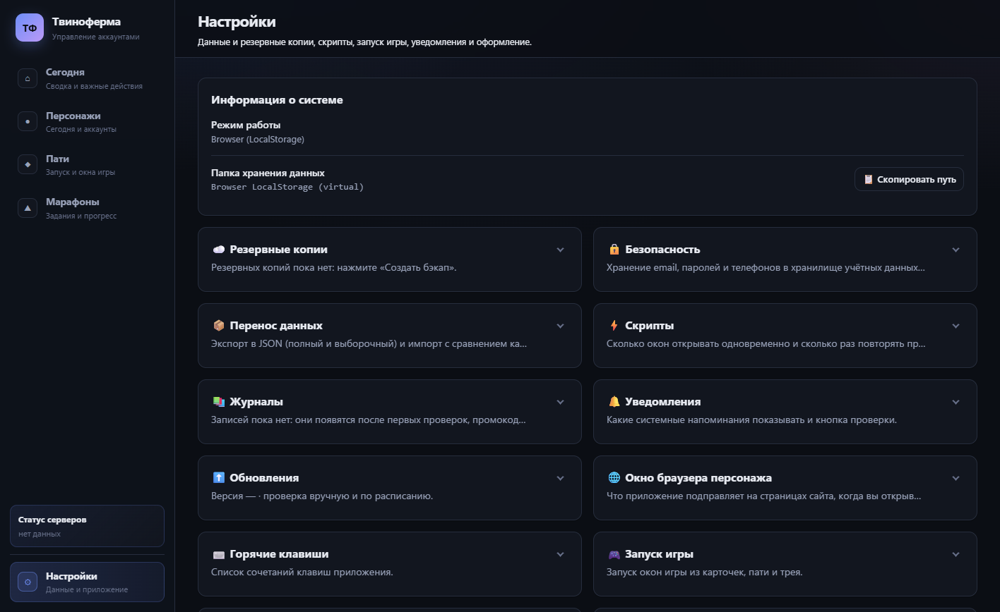

# 🛠️ Твиноферма (Tvinoferma)

**Твиноферма** — это удобный десктопный инструмент для игроков в *Perfect World*. Приложение служит личным кабинетом для управления несколькими игровыми аккаунтами, автоматизации процессов авторизации на сайте игры, отслеживания баланса древних монет и хранения полезных данных о персонажах.

> ⚠️ **Важно:** Данная программа является только **локальным менеджером**. Она **не взаимодействует напрямую с игровым сервером**, не играет за вас и не является читом. Все действия выполняются через официальный сайт игры в встроенном безопасном браузере.

## ✨ Ключевые возможности

### 👥 Управление пати (Группами аккаунтов)
Организуйте ваши десятки аккаунтов в логические группы («партии») для удобного переключения и мониторинга.
*   **Наглядный интерфейс:** Карточки пати показывают количество персонажей и общий баланс древних монет даже в свернутом виде.
*   **Drag & Drop:** Меняйте порядок пати перетаскиванием мыши. Порядок сохраняется автоматически.
*   **Статус подключения:** Видите, какие персонажи авторизованы, а какие требуют повторной авторизации.
*   **Несколько пати у одного персонажа:** персонаж может состоять в нескольких партиях сразу (основная группа + отдельная для марафона). В карточке видна основная пати и раскрывающийся список остальных.

### 🔐 Ассистент авторизации (Login Assistant)
Забудьте о постоянном вводе логинов и паролей в разных вкладках браузера.
*   **Индивидуальные профили:** Для каждого персонажа создается изолированная браузерная сессия. Это предотвращает конфликты куки между аккаунтами.
*   **Быстрый вход:** Нажмите кнопку «Открыть», и браузер запустится с уже введенными данными или готовой формой входа.
*   **Проверка статуса:** Встроенный фильтр позволяет массово проверить, кто из ваших персонажей все еще залогинен, а чья сессия истекла. Процесс сопровождается индикатором прогресса. Проверить одного персонажа можно из меню «🔄 Проверить» в его карточке.
*   **Отмена:** любую массовую проверку (вход, баланс, сверка марафонов) можно остановить кнопкой «Отмена».

### 💰 Мониторинг ресурсов и истории
Держите руку на пульсе экономики ваших аккаунтов.
*   **Баланс Древних Монет:** Автоматическое получение текущего баланса монет для выбранных персонажей. Данные выводятся в консоль и отображаются в интерфейсе.
*   **История транзакций:** Подробный журнал изменений баланса с точностью до секунды (`ЧЧ:ММ:СС`). Вы всегда знаете, когда и сколько было потрачено или заработано.
*   **Уведомления об обновлении:** Прогресс-бар показывает процент выполнения запросов к сайту во время обновления балансов.

### 🏁 Марафоны
Планируйте марафоны и следите за прогрессом каждого персонажа.
*   **Мастер добавления:** найдите марафон на сайте по названию или добавьте вручную. Описания заданий подтягиваются со страницы марафона и из новости (источники не смешиваются между разными марафонами).
*   **Прогресс по персонажам:** какие задания выполнены, сколько осталось до цели и даты, сколько запасных дней.
*   **Сверка с сайтом:** прогресс можно обновить прямо с сайта для выбранных персонажей. Для сверки используется только чтение страниц.
*   **Календарь выбора даты** и «доп. пати» (дополнительные группы участников) в карточке марафона.

### 📋 Полезные инструменты
*   **Копирование данных:** Быстрое копирование Email, Пароля, Дополнительного Email и Телефона прямо из профиля персонажа по клику.
*   **Заметки и теги:** свободные заметки в карточке персонажа, теги и фильтры по классу, пати и тегу.
*   **Экспорт и импорт:** выгрузка всех данных в файл и загрузка обратно. При импорте приложение показывает отличия и предлагает объединить, оставить своё или взять из файла.

### 🛡️ Надёжность данных
*   **Резервные копии:** копия файла данных создаётся перед импортом и перед обновлением схемы данных, хранится последние 10 (число настраивается); запись файла атомарная, обрыв питания не оставит «обрезанный» файл.
*   **Миграции:** при обновлении приложения старый файл данных автоматически приводится к новой схеме.
*   **Автообновление:** приложение проверяет новые версии на GitHub при запуске и по кнопке; подпись обновления проверяется публичным ключом.

<!--
## 🖼️ Скриншоты
Добавьте снимки (без реальных ников и паролей!) в docs/screenshots/ и раскомментируйте:

-->

## 📥 Установка и использование

1.  Скачайте последнюю версию из раздела [Releases](https://github.com/drednight/Tvinoferma/releases): установщик `.msi` или `-setup.exe`.
2.  Запустите установщик. Дальше приложение обновляется само.
3.  Откройте «Твиноферма» из меню «Пуск».

Поддерживается **Windows 10/11** (нужен WebView2, он входит в современные сборки Windows). Сборки для macOS и Linux не проверяются.

### Как начать работу?
1.  **Добавьте персонажей:** Введите данные учетных записей (логин/пароль) в базу менеджера.
2.  **Создайте пати:** Сгруппируйте персонажей по вашему усмотрению (например, "Основная группа", "Крипочки").
3.  **Авторизуйтесь:** Используйте кнопку **"Open Site"** (или помощник входа) для первого ручного подтверждения личности на сайте игры. После этого программа запомнит сессию.
4.  **Используйте ежедневно:** Проверяйте статус авторизации, обновляйте баланс монет и просматривайте историю трат одним кликом.

## ❓ Частые вопросы

**Почему иногда нужно вводить пароль заново?**
Срок жизни куки-сессий на сайте игры ограничен. Если вы давно не заходили, потребуется пройти процедуру авторизации снова через встроенный браузер. Менеджер подскажет, у кого именно истекла сессия.

**Это безопасно?**
Данные хранятся только на вашем компьютере. Подробности — в разделе «Безопасность и приватность» ниже.

## 🔒 Безопасность и приватность

*   **Пароли:** логины, пароли, дополнительные e-mail и телефоны хранятся в хранилище учётных данных вашей ОС (Windows Credential Manager) и **не попадают в файл данных** приложения.
*   **Сессии (куки):** куки для `pwonline.ru` хранятся локально в зашифрованном виде (AES-256-GCM). Ключ шифрования лежит в хранилище ОС, поэтому файлы сессий без него бесполезны и на другой компьютер не переносятся. Куки VK / Mail.ru не сохраняются.
*   **Что уходит в сеть:** только `pwonline.ru` (страницы сайта в окнах приложения) и GitHub (проверка и загрузка обновлений). Телеметрии нет, ничего не отправляется «на сервер автора».
*   **Что делает приложение на сайте:** фоновые скрипты только **читают** страницы (баланс, статус входа, марафоны). Никаких кликов, отправки форм и запусков по расписанию. Подробнее — [docs/COMPLIANCE.md](docs/COMPLIANCE.md).
*   **Экспорт:** пароли попадают в файл экспорта только если вы отметили пункт «Пароли» (он помечен как опасный). Такой файл храните как пароль и не отправляйте другим.

## 🧑‍💻 Для разработчиков

*   Как запустить, проверить и выпустить версию: [CONTRIBUTING.md](CONTRIBUTING.md).
*   Как устроено приложение: [docs/ARCHITECTURE.md](docs/ARCHITECTURE.md).
*   План развития: [ROADMAP.md](ROADMAP.md).

## 🤝 Поддержка

Если у вас возникли проблемы с работой приложения или есть предложения по улучшению функционала:
*   Создайте Issue в разделе [Issues](https://github.com/drednight/Tvinoferma/issues).
*   Пожалуйста, прикладывайте скриншоты ошибок и описание действий, которые привели к проблеме.

---
*Perfect World is a registered trademark of its respective owners. This software is an independent third-party utility designed to assist players with account management via the official game website.*
